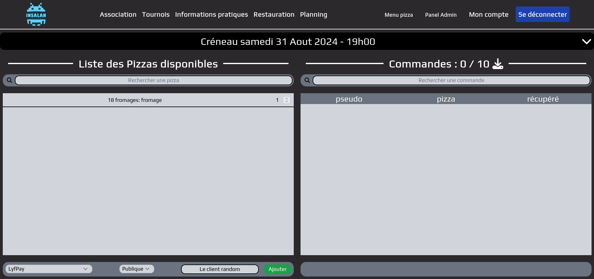
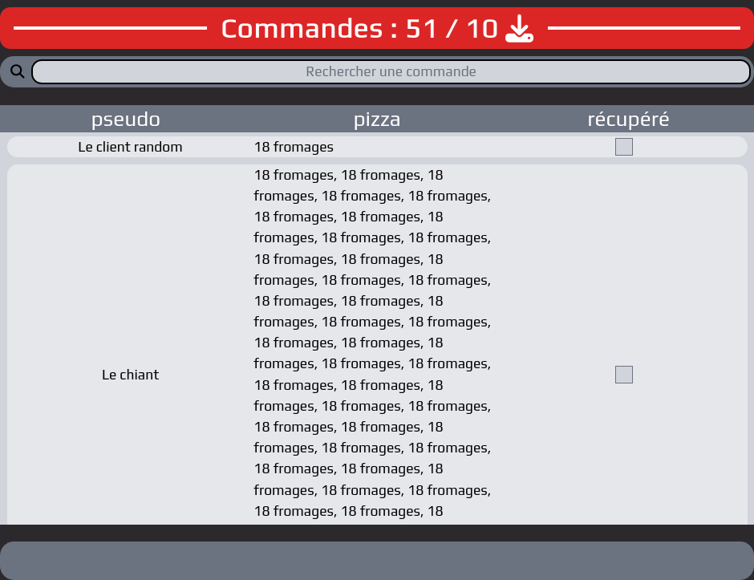

# Créneau

Vous voilà le jour de la lan, c'est la panique côté sysrez mais chez vous ça
chill. Si vous avez un petit trou de mémoire ou des questions, voilà un petit
rappel de ce qui est disponible pour vous aider sur le site.

## Prise de commande

Pendant un créneau, des "clients" vont passer et faire des commandes. "Bonjour,
une 18 fromages pour 19h. Merci." (il manquera le merci des fois.) Et vous
pourrez les ajouter sur le site. Pour cela, il faut sélectionner les pizzas, les
quantités associées et remplir les informations en bas à gauche de la page.
Moyen de paiement, le tarif et un pseudo ou nom.



En validant, vous aurez une popup de confirmation avec le prix à payer.

## Historique des commandes

L'historique des commandes apparaît à droite de la page. Vous pouvez voir le
pseudo donnée, le contenu et le statut de réception de la commande. Une commande
ne peux pas être modifiée sur le site une fois validée. En cas de soucis, vous
pouvez demande à un membre de la team dev qui la modifiera directement dans le
backoffice (vous pouvez le faire aussi mais c'est compliqué pour pas grand chose
donc bon, demandez, c'est plus simple pour tout le monde).



Vous pouvez également voir au dessus du recap des commandes, le nombre total de
pizzas pour ce créneau.

## Envoi des commandes

Au moins à la fin de chaque créneau de commandes (ou plus souvent si vous le
souhaitez), vous pouvez exporter la liste des commandes pour les envoyer au
fournisseur. Pour cela, il suffit de cliquer sur le bouton "Exporter" (l'icône
de flèche vers le bas) en haut à droite de la page. Vous aurez alors un fichier
contenant les nouvelles commandes (depuis le dernier export) et le total.

L'export permet d'obtenir un fichier de ce format :
```
samedi 31 Aout 2024 - 19h00
export 1
  - 18 fromages : 51
total
  - 18 fromages : 51
Nombre de pizza : 51
```

⚠️ Attention, si vous faîtes un export sans faire exprès, cela va fausser
l'export suivant qui ne comptera pas les commandes déjà exportées dans la partie
différentiel. Quand cela arrive, il faut supprimer l'export depuis la page
"Liste des exports" à coté du "Menu Pizza" ou demander à la team dev de le
faire.

## Liste des exports

À propos de la liste des exports, c'est une page depuis laquelle vous pouvez
voir les exports d'un créneau et les retélécharger en cliquant dessus, vous
pouvez aussi quand c'est nécessaire les supprimer en cliquant sur le bouton
supprimer.

## Récupération des commandes

Un peu plus simple sur ce coup ci, quelqu'un arrive, "Bonjour, moi c'est XXX, je
viens récupérer les pizzas". Vous le trouver dans la liste, cliquer sur la coche
à droite de sa commande et c'est tout. Pensez quand même toujours à vérifier que
la case est bien coché après pour ne pas avoir de surprise.

Si la connexion internet est lente ou coupé, ne burinez pas les boutons,
attendez un peu et ça devrait passer. Si ça ne passe pas, allez crié sur un
sysrez, ça sert à rien mais ça défoule.
