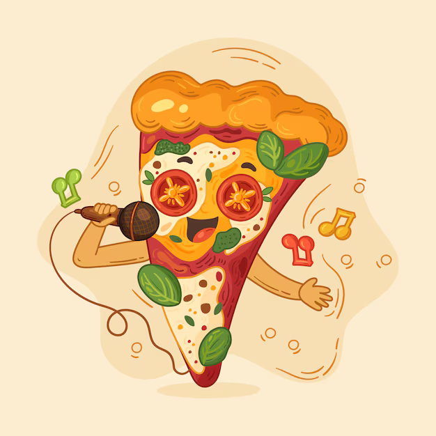

# Equipe bouffe

Assurez vous d'avoir mangé avant de lire ce manuel parce qu'ici on va parler que
de Pizza, vous risquez d'avoir faim. L'équipe bouffe est chargée pendant les
minis et la LAN de gérer les commandes de pizza. Cela comprend la prise des
commandes, la livraison et la récupération. Pour cela, votre meilleur ami sera
le site ! Vous trouverez dans les pages suivantes tout ce que vous devez savoir
pour gérer les commandes de pizza.

  

