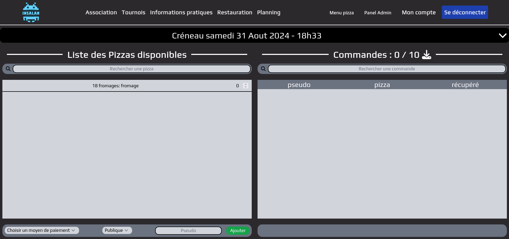

# Préparation

Tout d'abord, comment préparer les créneaux de commandes de pizza ? Bon, il ne
faut pas s'y prendre au dernier moment, il y a quelques étapes à suivre sur le
site avant le début de l'event. Il est conseillé de tester également avec un
faux créneau que vous pouvez supprimer après.

Rendez vous sur la page d'accueil du site [Insalan](https://insalan.fr) et
connectez vous avec un compte de l'équipe Bouffe. Ensuite, vous aurez accès au
différentes pages de l'équipe bouffe depuis le menu déroulant "Admin" en haut à
droite. Cliquez dessus pour accéder à la page de commande.

Le menu "Admin" n'apparaît que sur un ordinateur. Si le site est en mode petit
écran avec le grand menu déroulant à droite vous n'y aurez pas accès (pensez à
maximiser la fenêtre votre navigateur).

Si malgré ça le menu n'apparaît pas ou que les pages de la équipe Bouffe ne
s'affiche pas, déconnectez vous, rafraîchissez la page et reconnecter vous. Et
si c'est toujours pas bon, allez vous plaindre au resp Web.

## Création des pizzas

La première page qui nous intéresse est la page de pour gérer les pizzas. Elle
se trouve dans "Admin" -> "Liste des Pizzas". Sinon cliquez
[ici](https://insalan.fr/admin/pizza/list). En allant sur cette page, vous
pouvez ajouter les pizzas qui seront disponibles lors de l'event. Pour cela, il
suffit de cliquer sur le bouton "Ajouter une nouvelle pizza" en haut à gauche de
la page et de rentrer les informations. Pour les images, il est conseillé de
juste le celles du site de dominos (ou autre en cas de changement de fournisseur).

Quelques informations sont à rentrer comme la liste des ingrédients ou la liste
des allergènes. Le prix n'est pas relatif aux pizza mais on va y revenir plus
tard.

Depuis cette page, vous pouvez aussi modifier les pizzas déjà existantes et les
supprimer.

⚠️ Il ne faut pas supprimer une pizzas pendant qu'un créneau est cours sinon les
commandes de cette pizza vont disparaître.

## Création des créneaux

Pour créer et gérer les créneau il faut aller dans "Admin" -> "Menu Pizza". Sur
cette page, vous pouvez ajouter des créneaux de commandes de pizza. Pour cela,
il suffit de cliquer sur le bouton "Ajouter un créneau" en haut de la page. Vous
pouvez alors rentrer les informations du créneau comme la date et l'heure de
début et de fin, le nombre de pizzas disponibles, et le prix de la pizza. Comme
précisé plus haut, la création des créneaux est conseillée en amont pour éviter
de se retrouver à devoir le faire pendant l'event.

Vous arriveriez alors sur la page du créneau créé.

Vous pouvez créer plus de créneau en cliquant sur le menu déroulant en haut de
la page. Vous pouvez aussi supprimer un créneau en cliquant sur l'icône de la
poubelle à droite du créneau mais attention, cela supprimera aussi les commandes
associées.
