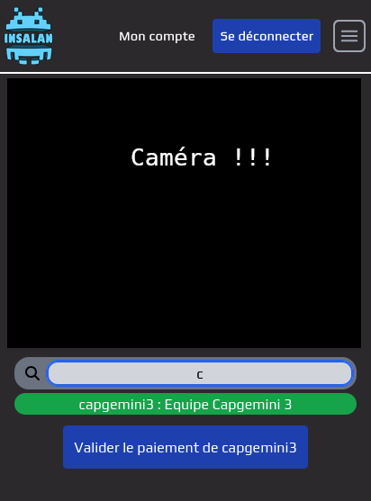

# Accueil

Le jour de la LAN, vous aurez besoin d'accueillir les joueurs et de valider leur billets. Les billets des joueurs sont envoyés par mail et contiennent un QR code et quelques informations sur le joueur. 

# Scanner un billet

Pour ceci, il faut vous munir d'un téléphone ou d'une tablette avec un accès à internet et une caméra. Veuillez bien à ce que l'accès à internet soit stable pour ne pas ralentir le processus d'entrée. En vous connectant sur une compte administrateur (bureau ou équipe dev), vous aurez accès à une option "Scan billet" dans le menu déroulant en haut à droite. Attention, ce bouton n'apparaît que si vous êtes connecté sur un appareil mobile et que vous avez les droits nécessaires (pas de triche !).

Une fois sur la page de scan, vous n'avez plus qu'à scanner le QR code du billet du joueur. Si le billet est valide, vous aurez un message de confirmation et le joueur pourra entrer. Si le billet n'est pas valide, vous aurez un message d'erreur et le joueur ne pourra pas entrer. Pensez également à vérifier l'identité du joueur.

  

# Et si le joueur n'a pas payé ?

Bon, mise en situation : un joueur arrive à l'entrée et là, pas de billet. "Euh, j'ai pas payé sur le site, je compte le faire sur place". Que faire ?

Pas de panique, il suffit de chercher son pseudo dans le champ de recherche en bas de l'écran. Si le joueur est bien inscrit, vous aurez accès à ses informations. Faîtes ensuite payer le joueur (souvent majoré de 5 euros parce que fais chier) et cliquer bien sur le bouton "valider" sur le site.

/!\ Attention, si vous ne cliquez pas sur le bouton "valider", le joueur ne pourra pas accéder à internet et il viendra chouiner à un sysrez qui sera obligé de sortir de sa sieste un membre de l'équipe dev qui finira par juste valider son billet parce qu'on aura aucune preuve que quelqu'un l'a bien fait payer. Donc PLEASE ! Validez bien le billet. /!\

