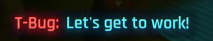

# Bureau et équipe dev

Côté bureau, moins de choses à savoir et à faire que l'équipe tournois mais
disons que vos erreurs seront un peu plus visibles que les autres. Bah oui,
c'est vous les patrons !

C'est aussi pour cette raison que je vous conseille de lire tout ce manuel, même
si vous n'avez pas l'intention de tout faire. Cela vous permettra de pouvoir
aider les équipes ou au moins comprendre ce qu'elles font.

  

