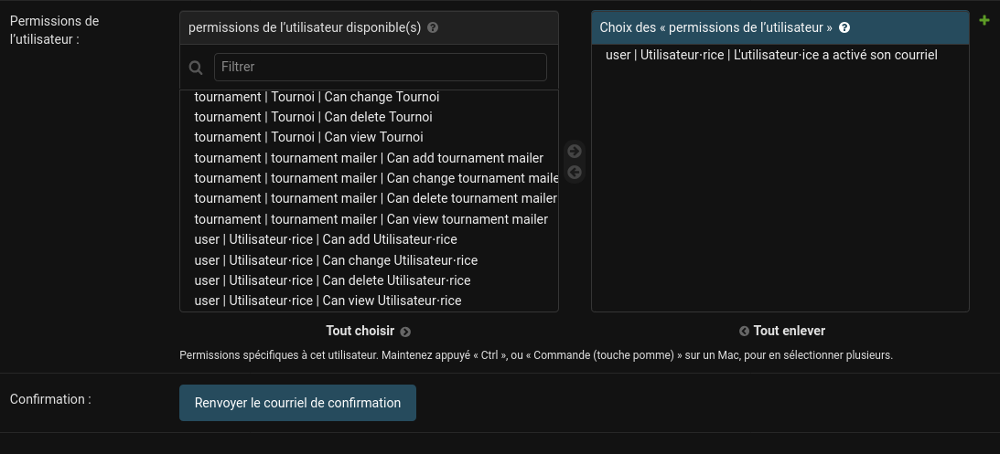

# Utilisateurs

Le bureau au même titre que l'équipe dev possède tout tout les droits sur le
site. Cela signifie que vous pouvez tout faire, mais attention à ne pas tout
casser. Vous faîtes également partie du peu de personne qui a la possibilité de
modifier les informations des utilisateurs. C'est donc à vous de vérifier que
les informations sont correctes et à jour.

## Liste des utilisateurs

Comme d'hab, pour lister les utilisateurs, il suffit de se rendre sur la page
[Utilisateurs](https://api.insalan.fr/v1/admin/user/user/) du site. Les
informations basiques des utilisateurs sont affichées ici, et vous pouvez en
ajouter ou en modifier en cliquant sur leur numéro en début de ligne.

Au niveau des permissions, faîtes attention à ne pas donner de droits à
quelqu'un hors insalan. Il est aussi conseillé de restreindre les droits au
maximum pour éviter les problèmes (ne pas donner un autre rôle que "bouffe" à un
membre de l'équipe tournois qui n'en aurait pas besoin). Vous êtes aussi
responsable d'enlever les droits des personnes qui n'en ont plus besoin (vieux
cons n'ayant plus besoin d'accès au site).

Pour la confirmation par mail (car c'est une des questions que vous rencontrerez
le plus), vous pouvez soit renvoyer un mail de confirmation depuis la page de
l'utilisateur (modifier -> Permissions -> Renvoyer le courriel de confirmation),
soit assigner la permission "L'utilisateur.ice a activé son courriel".

