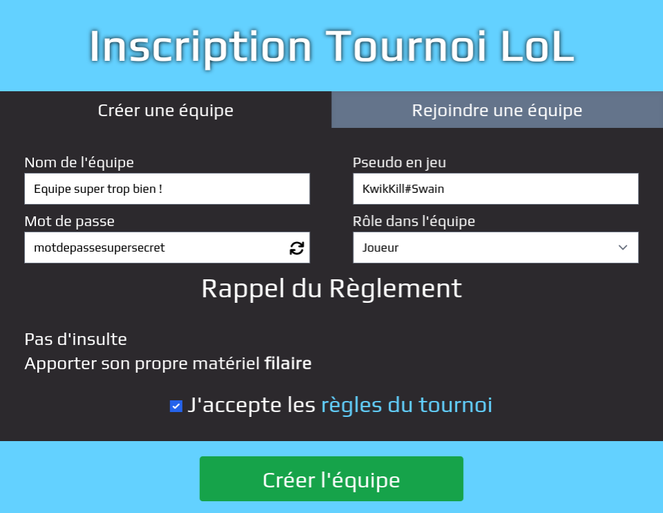

# Inscription

Pour pouvoir accéder au fonctionnalités du site, il est nécessaire de posséder
un compte. Pour cela, il suffit de se rendre sur la page d'inscription du site
et de remplir le formulaire. Une fois le compte créé, il est possible de se
connecter et de modifier ses informations personnelles au besoin dans la section
"Mon compte".

## Tournois

Les tournois ouvert apparaissent sur la page d'accueil du site. Plusieurs status
sont disponibles entre non annoncé, annoncé, ouvert et fermé. Les tournois
ouverts sont accessibles à l'inscription. 

Les joueurs peuvent soit créer une équipe et inviter des joueurs, soit rejoindre
une équipe existante. Pour créer une équipe il faut remplir plusieurs
informations dont le nom de l'équipe et un mot de passe pour la rejoindre. Pour
rejoindre une équipe, il faut connaître le nom de l'équipe et le mot de passe.
Il est aussi possible de rejoindre une équipe en ouvrant le lien d'invitation
reçu lors de la création de l'équipe. Ce lien n'est pas récupérable après la
création de l'équipe et une des demandes les plus fréquentes est l'oublie du mot
de passe ou la perte du lien d'invitation. Le seul moyen de le récupérer est de
réinitialiser le mot de passe de l'équipe.

## Pseudo

Le Pseudo en jeu des joueurs est requis pour le bon fonctionnement des tournois.
Que ce soit pour la préparation des phases qualificatives ou pour la création
des matchs. Si le jeu le permet, ce pseudo est vérifié afin de s'assurer qu'il
soit valide. 

## Validation

Une fois l'équipe créée ou rejointe, il est impossible de s'inscrire à un autre
tournoi du même événement pour éviter les problèmes de conflits d'horaires. 

Une équipe possède un status qui peut être "En attente" ou "Validée". Cela
dépend du nombre de joueurs ayant payé leur place dans l'équipe. Une équipe dont
plus de la moitié des joueurs ont payé leur place est validée. Une équipe en
attente est une équipe qui n'a pas encore atteint ce quota.