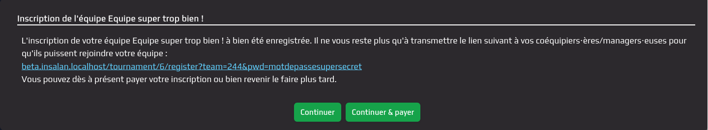

# Paiement

## Paiement en ligne

Il est possible pour les joueurs de payer leur place de deux manières
différentes. Soit directement à la création de l'équipe ou en rejoignant une
équipe existante, soit plus tard depuis la page de gestion de l'équipe, dans
l'onglet "Mon compte". Une fois le paiement effectué, le status de l'équipe est
changé si nécessaire.

## Paiement sur place

Si un joueur n'a pas payé mais que l'équipe est validée, il est possible de
payer sur place. Pour cela, il suffit de se rendre à l'accueil de la LAN et de
payer en espèces ou par carte bancaire. Habituellement, le paiement est majoré
de quelques euros pour inciter les joueurs à payer en ligne. Il est ensuite
possible de valider le joueur depuis l'outil de scan des tickets.

## Remboursement

Si un joueur a payé sa place mais ne peut finalement pas venir, il est possible
de procéder à un remboursement. Les délais sont souvent assez arbitraire et il y
a parfois des échanges de joueurs au sein des équipes. Dans le mois précédant la
LAN, il faut être réactif et communiquer avec les joueurs pour éviter de
potentielles erreurs.
    