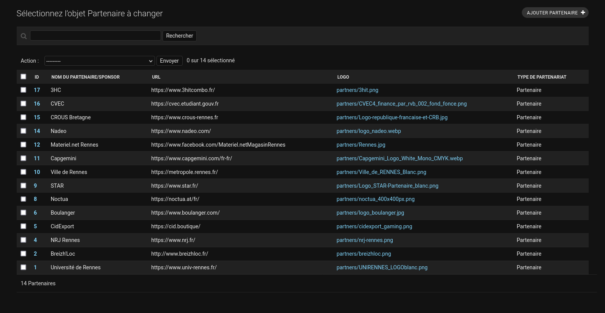
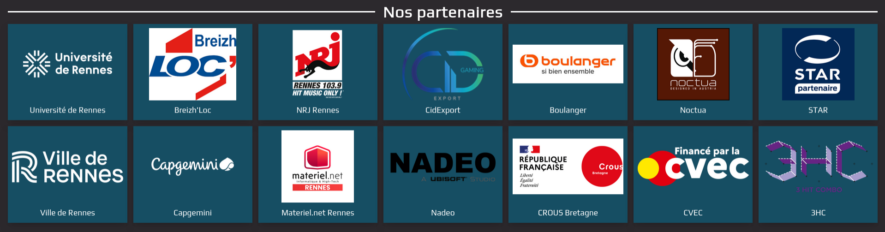

# Équipe partenariat

Côté partenariat, il n'y a pas énormément d'informations à connaître. Cependant,
il est important que le responsable dev ne passe pas 80% de son temps en
explication de tout les côtés. On compte sur vous pour être le plus autonome
possible !

## Les partenaires

Les partenaires sont des entreprises qui nous aident à financer ou organiser
l'Insalan. En échange, nous leur offrons de la visibilité sur notre site, sur
nos réseaux sociaux, et sur nos supports de communication. Il est important de
bien les traiter, car sans eux, l'Insalan ne pourrait pas exister.

Et du coup c'est quoi votre boulot dans cette histoire ? Bah ça c'est à vous de
le savoir. Mais une fois le contrat signé, il faut afficher leur logo sur le
site, et s'assurer qu'ils sont bien visibles pendant l'événement. Et c'est là où
ce manuel peut vous aider.

## Liste des partenaires

Pour lister les partenaires sur le site, il suffit de se rendre sur la page
[Partenaires](https://api.insalan.fr/v1/admin/partner/partner/) du site. Les
informations basiques des partenaires sont affichées ici, et vous pouvez en
ajouter ou en modifier.

## Modifier un partenaire

Pour modifier un partenaire, il suffit de cliquer sur son numéro en début de
ligne. Vous pouvez alors modifier les informations du partenaire, et notamment
son logo ou le lien de redirection.

## Ajouter un partenaire

Pour ajouter un partenaire, il suffit de cliquer sur le bouton "Ajouter un
partenaire" en haut de la page. Vous pouvez alors remplir les informations du
partenaire, et notamment son logo ou le lien de redirection.

## Visualiser sur le site.

En bas de la [page d'accueil du site](https://insalan.fr), vous pouvez voir les
partenaires que vous avez ajouté ou modifié. Et voilà ! Vous savez tout ce qu'il
faut savoir.

