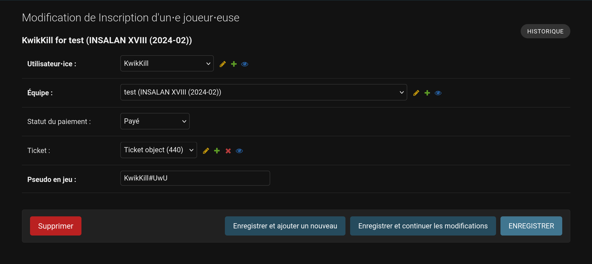

# Organisation

Le site de l'insalan et particulièrement la partie tournois est décomposé en
plusieurs parties interconnectées. Beaucoup de ces parties nécessites une
définition et possèdent des limites au niveau de l'implémentation. En cas de
modification plus poussée que décrite dans cette documentation, il est
recommandé de contacter l'équipe dev pour planifier une amélioration du site.
N'hésitez pas ! C'est comme ça qu'on peut vous aider au mieux !

Pour la gestion des tournois, tout se fait depuis le panel admin du site. Il est
accessible depuis le menu de navigation en haut à droite si vous êtes connecté
en tant que membre de l'association (faîtes valider votre compte par un membre
de l'équipe dev si ce n'est pas déjà fait). Une fois sur le panel admin, vous
devriez avoir une section "Tournois" qui vous permettra de gérer les tournois et
les équipes.

## Événements

Un événement est une entité regroupant plusieurs tournois. Chaque itération de
l'insalan est considéré comme un événement. Pour l'instant seulement les
éditions sont représentable sur le site mais il est prévu (possiblement dans un
futur lointain) de pouvoir utiliser le site pour des tournois en mini.

Pour lister les événements, il suffit de se rendre sur la [page
correspondante](https://api.insalan.fr/v1/admin/tournament/event/) du panel
admin. Pour en créer un nouveau, il suffit de cliquer sur le bouton "Ajouter
événement" en haut à droite de la page. Un certain nombre d'information vous
sera demandé.

Parmis ces informations, certaines ont besoin d'explications :
- Le champ "En cours" permet de définir si l'événement est actif ou non. Si
  l'événement est actif, les tournois associés seront affichés sur la page
  d'accueil du site en tant qu'événement courant. Sinon, il sera accessible dans
  la section archives.
- Le champ "Siège" contient un espace pour définir le plan de la Halle. Vous
  aurez besoin d'un petit peu d'esprit artistique pour représenter les tables
  sous forme de pixels. Pour plus d'exemple, vous trouverez un exemple (édition
  XVIII) ci dessous. Il n'est pas nécessaire de respecter les distances.
  Seulement de pouvoir reconnaître les groupes de tables.

 

Ces informations peuvent être changées à tout moment en cliquant sur le numéro
du tournois dans le panel admin.

## Jeux

Bon, vous allez peut-être avoir du mal à me croire mais les jeux présent lors de
la LAN sont appelés "jeux" dans le panel admin. C'est fou non ? De la même
manière que les événement et si vous l'avez compris vous n'allez pas être
dépaysé par la suite, vous pouvez les lister sur la [page
correspondante](https://api.insalan.fr/v1/admin/tournament/game/). Pour en
ajouter un, il suffit de cliquer sur le bouton "Ajouter jeu" en haut à droite de
la page. Les informations à remplir sont relativement simples et ne nécessitent
pas d'explications supplémentaires. Pour les différentes validations de nom,
cela doit être implémenté dans le code du site. Si vous avez besoin d'ajouter un
jeu, contactez l'équipe dev.

## Tournois

Un tournois est l'intersection entre un événement et un jeu. C'est plus ou moins
l'entité principale du site. Je ne vais pas revenir sur la manière de lister ou
ajouter un nouveau tournois, vous avez compris le principe. Par contre, il y a
quelques informations à savoir sur les tournois.

Un événement non annoncé apparaîtra sous forme d'un point d'interrogation sur la
page d'accueil du site. Aucun détail ne sera affiché et il ne sera pas possible
de s'inscrire.

La description d'un tournois peut contenir du markdown, un format de texte qui
permet de mettre en forme le texte. Vous pouvez trouver plus d'informations sur
le markdown [ici](https://commonmark.org/). Il est vivement conseillé de
s'inspirer du règlement de l'édition précédente pour ne pas avoir à tout
réécrire.

Les dates d'inscription et de début de tournois sont des dates importantes. Les
joueurs ne pourront pas s'inscrire avant la date d'ouverture et ne pourront plus
s'inscrire après la date de fermeture. Il faut donc être attentif à ces dates
pour éviter des problèmes.

Le champ logo est l'image du tournois. Il est conseillé de mettre une image de
format vidéo (16:9) pour un meilleur rendu sur le site. Il est également
important de vérifier les droits d'utilisation de l'image avant de la mettre en
ligne. Afin d'améliorer le chargement du site, le format webp est privilégié. Si
vous ne savez pas comment convertir une image en webp, contactez l'équipe dev.

Les différents prix de l'inscription ne sont pas sans importance. Faîtes
attention, cela déterminera le prix de l'inscription en ligne. Ces prix doivent
être définis par le bureau en fonction du nombre de place et du budget
prévisionnel.

Le cashprize est une information importante pour les joueurs. Si le cashprize
n'a pas encore été défini, vous pouvez laisser le champ vide. L'affichage du
cashprize sur le site est automatique. Sinon, Ce champ doit contenir 3 valeurs
séparées par des virgules. La première valeur est le cashprize pour le premier,
la deuxième pour le deuxième et,... La troisième pour le troisième !

Les différents "produits" n'ont pas à être touchés, ils seront créés
automatiquement lors de la création du tournois à partir des informations de
prix. Si vous avez besoin de modifier les produits, contactez l'équipe dev.

Le reste devrait être un jeu d'enfant et vous devriez avoir de jolis tournois
sur la page d'accueil du site.

## Inscriptions

Pour représenter l'information de la participation d'un joueur à un tournois on
doit procéder en deux étapes. Un joueur appartient à une équipe qui est inscrite
au tournois. Pour les jeux solo (TrackMania, TFT, Hearthstone ou même 1v1
krunker.io), une équipe est quand même nécessaire. C'est un peu bizarre mais
c'est comme ça.

Parmis ces équipes on retrouve plusieurs types d'inscriptions :
 - Les joueurs : Un joueur est quelqu'un qui participe à un tournois, a payé sa
   place et est prêt à en découdre.
 - Les remplaçants : Un remplaçant est quelqu'un qui peut participer à un
   tournois mais n'est pas sensé jouer sans autorisation. Il est là pour
   remplacer un joueur ayant un problème le jour J.
 - Les managers : Un manager est quelqu'un qui peut gérer l'équipe. Son réel
   intérêt est de pouvoir être avec les joueurs pendant la lan.

Ces trois types d'inscriptions sont gérés par les joueurs depuis le site mais il
faut néanmoins savoir les modifier en cas de soucis. Pour cela, le panel admin
reste votre meilleur ami.

### Équipes

Vous pouvez comme d'habitude lister les équipes sur la bonne page et les éditer
en cliquant sur leur numéro. Vous pouvez modifier un certain nombre
d'information mais il vous est demandé de faire attention notamment sur la
validation des équipes. Celle ci est automatique une équipe validée manuellement
sans le critère de validation attendu pourrais piquer la place d'une autre
équipe.

Il vous sera souvent demandé de récupérer le mot de passe d'une équipe car "On
l'a oublié", "On l'a perdu", "On l'a pas noté" ou "On l'a pas reçu" (pff). Pour
cela, il suffit de cliquer sur le formulaire dans le champ "Mot de passe" et de
le modifier. Vous ne pouvez pas récupérer un mot de passe perdu, seulement le
changer.

### Inscription de joueur

Une inscription de joueur contient plusieurs informations : le status du
paiement, son ticket d'entrée mais surtout son pseudo.

Il arrivera souvent que certaines informations soient à changer (pseudo, équipe
ou même joueur en cas de changement sans remboursement), c'est assez simple et
intuitif à faire.

Il peut y avoir en fonction du jeu une validation de pseudo (afin de vérifier
l'existence du compte renseigné par le joueur), cela vous sera indiqué en cas de
pseudo invalide.

### Inscription de remplaçant

Une inscription de remplaçant est la même chose qu'une inscription de joueur.
Vraiment, aucun changement à part le type d'inscription.

### Inscription de manager

Une inscription de manager est la même chose qu'une inscription de joueur mais
le pseudo en moins. ça casse pas 3 pattes à un canard.

Et là vous vous dites "Mais ! C'est déjà super long comme documentation ! J'ai une game de lol à lancer moi !". Du coup je vais pas trop vous embêter plus longtemps. Juste un dernier petit détail.

### Validation des pseudos

Afin de faciliter votre traval, certains jeux possèdent une validation automatique des pseudos. Cela permet de vérifier que le pseudo renseigné par le joueur existe bien sur la plateforme concernée. Par exemple, pour un tournoi de League of Legends, le pseudo sera vérifié sur les serveurs de Riot Games. Si le pseudo n'existe pas, une erreur sera affichée lors de l'inscription.

Pour paramétrer cette validation, il suffit de se rendre sur la page d'édition du jeu concerné et de choisir le type de validation approprié dans le menu déroulant. Si vous voulez ajouter un nouveau type de validation, contactez l'équipe dev pour qu'ils puissent l'implémenter.

Sur certains jeux, il est possible que le pseudo spécifié à l'inscription puisse changer avant le début du tournoi. Dans ce cas, il est possible de forcer une nouvelle validation des pseudos pour tous les joueurs inscrits à un tournoi. Vous pouvez le faire au cas par cas en allant sur la page d'édition de l'inscription du joueur et en cliquant sur le bouton "Revalider le pseudo". Vous pouvez aussi le faire en masse pour tous les joueurs inscrits à un tournoi en allant sur la page de l'inscription et en cliquant sur le bouton "Mettre à jour le pseudo en jeu".

Vous pouvez aussi choisir de revalider les pseudos de tous les joueurs inscrits à un tournoi en sélectionnant un tournoi dans la liste des tournois et en utilisant l'action "Mettre à jours les pseudos".

## Casters

Les casters sont des personnes qui commentent les matchs en direct. Je vous apprend pas grand chose là dessus. Pour les ajouter, il suffit de se rendre sur la [page correspondante](https://api.insalan.fr/v1/admin/tournament/caster/) et de cliquer sur "Ajouter caster". Vous aurez besoin de leur pseudo, d'une image (format webp, carré) et d'un lien vers leur profil twitch.

## Solicitations courantes

Si vous êtes arrivées là c'est soit que vous êtes très courageux (vous avez gagné un bon point ;\] ), soit que vous avez pas le choix parce que vous êtes tournois. Dans ce deuxième cas de figure, vous allez probablement être contacté par les joueurs en cas de soucis. Voilà une petite liste (malheureusement non exhaustive) des problèmes les plus courants :
- "J'ai pas reçu le mail de confirmation" : Vérifiez les spams, sinon vous pouvez renvoyer le mail de confirmation depuis le panel admin en allant sur l'utilisateur. Si vous n'avez pas les droits, demandez à un membre de l'équipe dev. Si le mail n'est pas reçu après plusieurs tentatives, vous pouvez le valider manuellement mais demandez bien les informations nécessaires pour vérifier l'identité du joueur (pseudo, équipe, mail,...).
- "J'ai oublié mon mot de passe/le mot de passe de l'équipe" : Vous pouvez le changer depuis le panel admin en allant sur l'équipe ou l'utilisateur. Il n'est pas possible de récupérer un mot de passe perdu.
- "Je veux changer de pseudo" : Vous pouvez le changer depuis le panel admin en allant sur l'inscription du joueur.
- "Je veux changer d'équipe" : Vous pouvez le changer depuis le panel admin en allant sur l'inscription du joueur. Attention aux quota de validation d'équipe. Changer un joueur manuellement d'équipe ne validera pas l'équipe si elle passe à plus de la moitié de joueurs ayant payé et n'invalidera pas l'équipe si elle passe en dessous de la moitié de joueurs ayant payé. Il est conseillé de vérifier les deux équipes après un changement d'équipe.
- "Je veux un remboursement" : C'est du classique mais là dessus ce n'est pas votre rôle. Le mieux est soit de le rediriger vers un membre de l'équipe dev, soit de le rediriger vers un membre du bureau.

Si d'autres problèmes surviennent et que vous ne savez pas comment les résoudre, votre premier réflexe doit être de contacter votre responsable. Il ne saura peut-être pas comment résoudre le problème mais au moins il pourra faire semblant de savoir.
